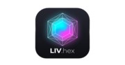

<div align="center">
  <h1>
    <br>
    LIV.hex
  </h1>
  <p><strong>A Modern, Fast, and Highly Interactive Color Palette Generator</strong></p>

  <p>
    
    
    
  </p>
</div>

<br/>

LIV.hex is not just another color picker. It's built from the ground up to focus on **beautiful micro-interactions, premium glassmorphism aesthetics, and strict accessibility**. Powered entirely by modern Angular Signals and structured with a clean Hexagonal Architecture.

---

## ✨ Features

| Feature | Description |
| :--- | :--- |
| 🎨 **Instant Harmonies** | Generate Analogous, Complementary, Triadic, or Monochromatic palettes with a single click. |
| 🎛️ **Precision Tuning** | Real-time HSL sliders and HEX text editing. Harmonic palettes adapt instantly as you adjust values. |
| 💎 **Premium UI/UX** | Fluid spring animations, glass-panel overlays, and dynamic CSS background gradients driven natively by CSS variables. |
| ♿ **Accessibility First**| Adaptive text colors with real-time WCAG 2.1 contrast ratio calculations (AAA / AA / Fail). |
| 💾 **Smart History** | Automatically saves your last 50 finalized colors to `localStorage` (ignores intermediate slider drags). |
| 📦 **Developer Export** | One-click export to CSS Custom Properties, Tailwind configuration, or structured JSON. |

## ⌨️ Global Shortcuts

Speed up your workflow with global keyboard bindings (intelligently disabled when typing in inputs):

- <kbd>Space</kbd> : Generate new color/palette
- <kbd>H</kbd> : Toggle History panel
- <kbd>E</kbd> : Toggle Export panel
- <kbd>Esc</kbd> : Close all open panels

## 🏗️ Architecture

Built using a strict **Screaming / Hexagonal Architecture** approach. The codebase tells you exactly what the app does at first glance, completely decoupling logic from presentation.

- **`/core`**: The brain. Pure TypeScript domain models (`ColorHsl`, `HarmonicType`), color math, WCAG contrast services, and global DOM event managers.
- **`/features`**: The muscle. Isolated, standalone UI components (`color-display`, `history-panel`, `export-panel`) built with pure vanilla CSS and zero external UI libraries.
- **`app.ts`**: The orchestrator. The single "smart" container that binds signals and delegates state to the "dumb" feature components.

## 🚀 Getting Started

### Prerequisites
- Node.js (v18+)
- npm / pnpm / yarn

### Installation & Development

```bash
# 1. Install dependencies
npm install

# 2. Start the development server
npm run start
```
Open your browser and navigate to `http://localhost:4200/`.

### Testing & Production

```bash
# Run the Vitest unit test suite
npm run test

# Build for production (AOT optimized)
npm run build
```
